# Event Horizon: what it does, with pictures

Event Horizon is a local, single-user journal. The server is a small Node
process on your own machine; the app is a page it serves; all data is plain
JSON files in the folder you unzipped. Nothing leaves the computer.

The screenshots below were taken on a demo copy filled with made-up data for a
fictional user. Your copy starts empty. They were captured in September 2026 and
a few of them predate the Rolodex, work mode and the "lessons from experience"
rename, so the left-hand column in an older shot is one or two entries short of
what you will see.

Contents

1. [The layout](#the-layout)
2. [Daily document](#daily-document)
3. [Morning survey](#morning-survey)
4. [Night survey](#night-survey)
5. [Tasks](#tasks)
6. [Calendar](#calendar)
7. [The output panel](#the-output-panel)
8. [Lists: lessons, learn-about, shopping](#lists-lessons-learn-about-shopping)
9. [The Rolodex](#the-rolodex)
10. [Goals, rules and the monthly review](#goals-rules-and-the-monthly-review)
11. [Trends](#trends)
12. [Settings](#settings)
13. [On a phone](#on-a-phone)
14. [Windows hotkeys: capture without opening the app](#windows-hotkeys-capture-without-opening-the-app)
15. [The task HUD](#the-task-hud)
16. [Work mode](#work-mode)
17. [Your data, exports and backups](#your-data-exports-and-backups)

## The layout

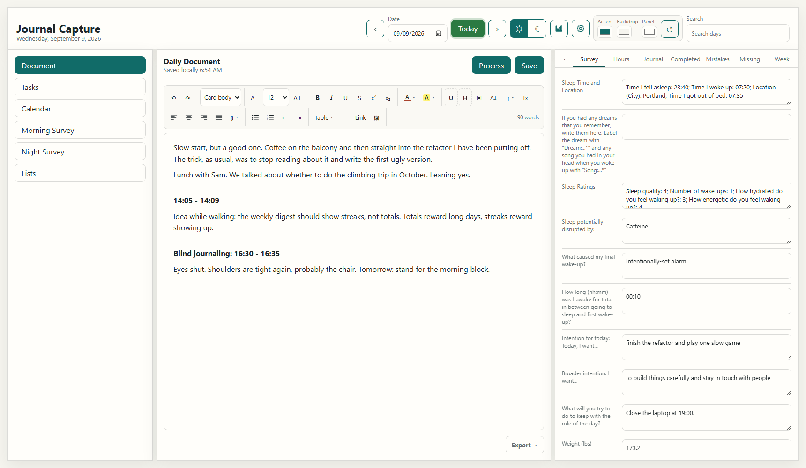

Three columns. The left column is the navigation: Document, Tasks, Calendar,
the two surveys, and a folding **Lists** group (Lessons, Learn, Shopping,
Rolodex). The
middle column is whatever view you picked. The right column is the **output
panel**, a set of tabs that show the day from different angles (the survey
answers as a table, the hour log, a read-only reader for the journal, and so
on) and stays put while you move between views. The `›` at its top-left
collapses it; the thin gutters between columns can be dragged to resize.

Across the top: the date you are editing (arrows step a day, **Today** jumps
back), a **theme toggle** (sun/moon; the app picks morning or night itself by
the clock, and the three color swatches let you re-tint it), a shortcut to
**Trends** and to **Settings**, and a search box that finds the days matching
a word or phrase.

Everything saves itself as you type. The line under the view title ("Saved
locally 6:47 AM") tells you the last save. If the server is unreachable the app
keeps a local copy and retries until it is back; nothing typed is lost.

## Daily document

Each day has one free-form document. It is a rich-text editor (headings,
lists, tables, links, pictures pasted in, colours, alignment) and is meant to
be typed or dictated into without much thought; the surveys and lists are
where things get structured later.

The blocks with bold time ranges in the screenshot above ("14:05 - 14:09",
"Blind journaling: 16:30 - 16:35") were not typed here. They came from the
quick-journal hotkey and the eye-rest timer (see [Windows hotkeys](#windows-hotkeys-capture-without-opening-the-app)),
which append to the day's document from anywhere in Windows.

**Process** reads the document and drafts survey answers and an hour-by-hour
log from it using the keyword lists at the top of `app.js` (mention "gym" and
the hour is tagged Exercise, and so on). It is a first draft to correct, not
an answer: look over the Survey and Hours tabs after pressing it.

The **Journal** tab of the output panel is a reader: the same text, cleaned up,
and you can keep scrolling into earlier days.

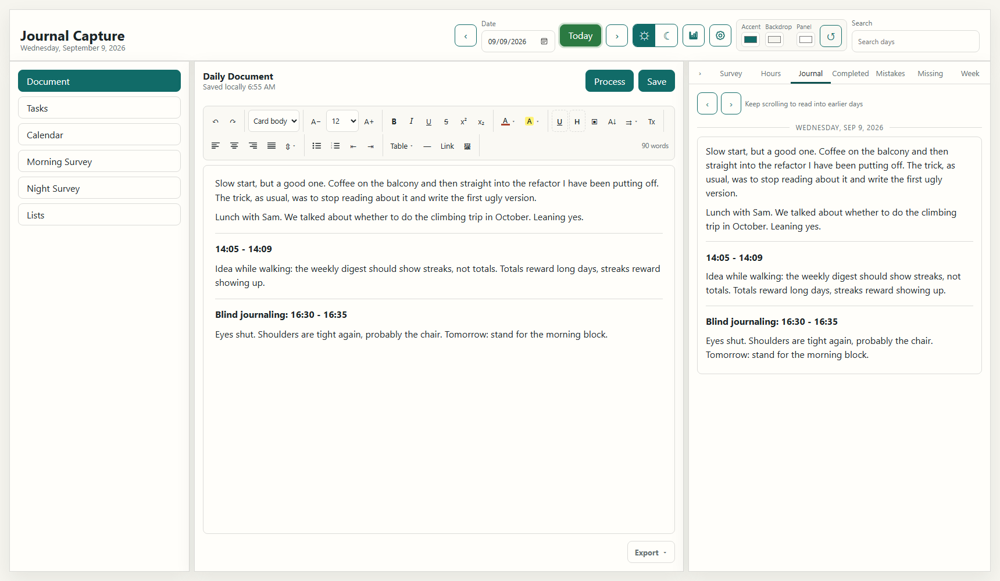

## Morning survey

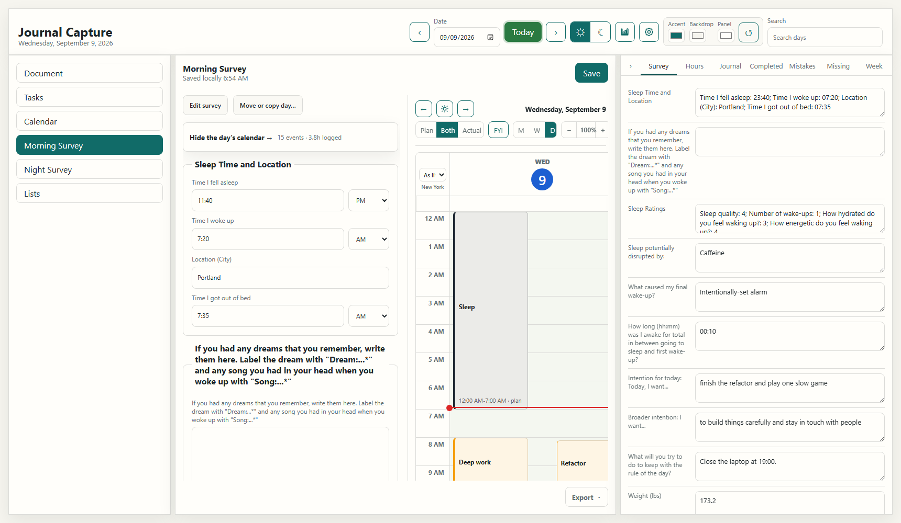

A fixed set of questions answered once a day:

- Sleep time and location (fell asleep, woke up, city, out of bed)
- Sleep ratings (quality, wake-ups, energy; 0 to 5 sliders)
- What disrupted sleep (multiple choice, plus anything you add)
- Intention for today, and a broader intention
- What you will do to keep the rule of the day (see [Goals](#goals-rules-and-the-monthly-review))
- Weight

Multiple-choice questions have an "Add option" box. Anything you type there
becomes a permanent choice from that day forward, so the questions grow with
you without touching code. **Edit survey** lets you hide questions you do not
want; **Move or copy day** moves a survey to the day it belongs to when you
filled it in late.

The day's calendar is shown beside the form (hide it with the link above the
first question) so you can answer "when did I get out of bed" by looking.

## Night survey

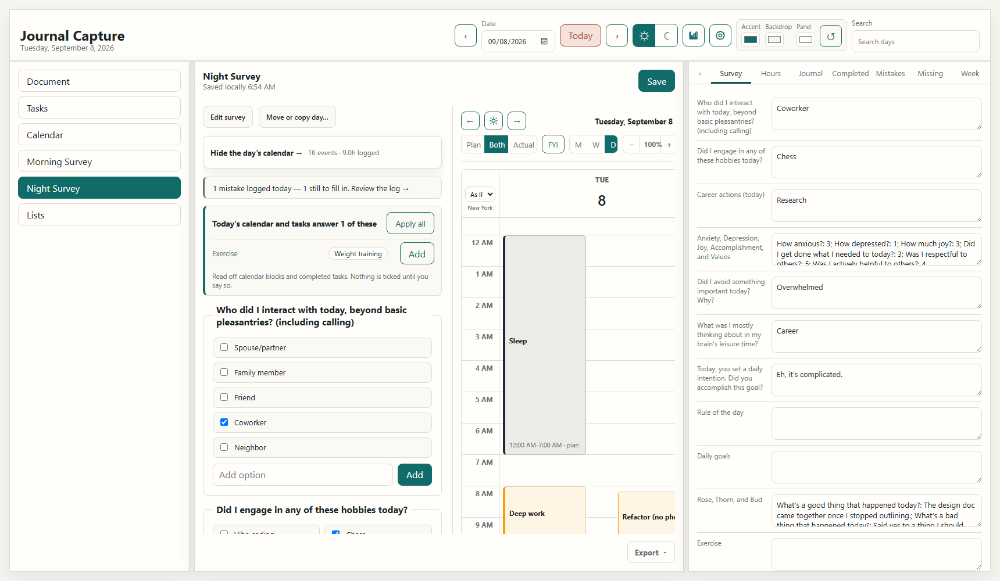

The evening set:

- Who you interacted with beyond pleasantries (partner, family, friend,
  coworker, neighbor, plus whoever you add)
- Hobbies today (reading, music, time outdoors, an instrument, plus yours)
- Joy and accomplishment (1 to 5 sliders)
- Whether you kept this morning's intention
- **Rule of the day** and **daily goals** check-ins (below)
- Rose, thorn and bud: a good thing, a bad thing, something you look forward to
- Exercise and naps
- The most memorable personal experience of the day (takes a picture)

This is deliberately a small starter set. The in-app survey editor
(**Edit survey**) adds questions of any of the 26 types, so the real survey is
whatever you grow it into.

Two panels at the top do some of the work for you. The **evidence panel**
("Today's calendar and tasks answer 1 of these") reads the day's calendar
blocks and completed tasks and offers to tick the matching answers; nothing is
ticked until you say so. The **lessons line** reminds you how many of today's
logged rows still have their reflection boxes empty.

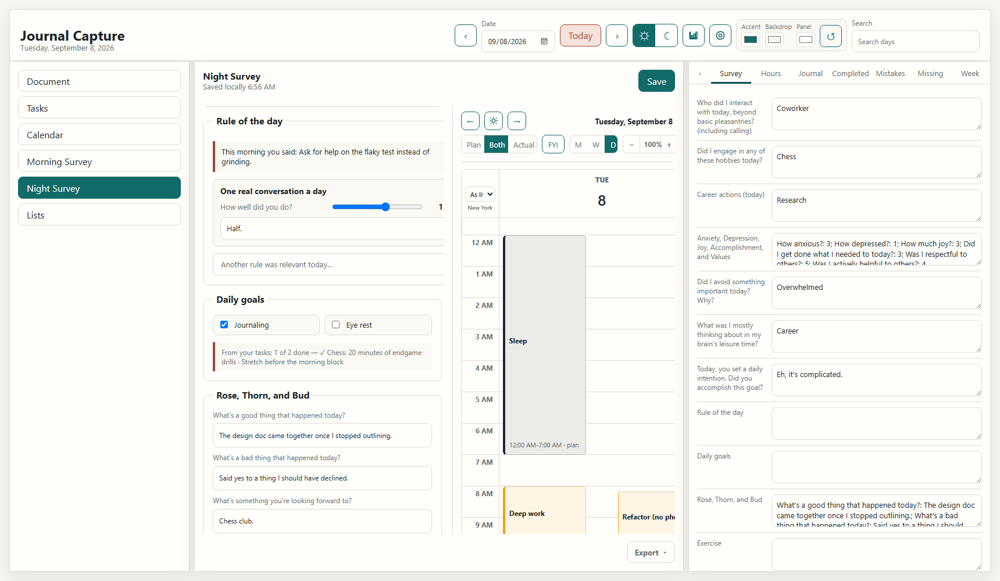

**Rule of the day** shows the rule that was scheduled for today, what you said
this morning you would do about it, and a -5 to +5 slider with a one-line
note. **Daily goals** is a checklist of your daily habits; the ones that
surface as tasks are read off the task list ("From your tasks: 1 of 2 done")
so you do not tick the same thing twice.

## Tasks

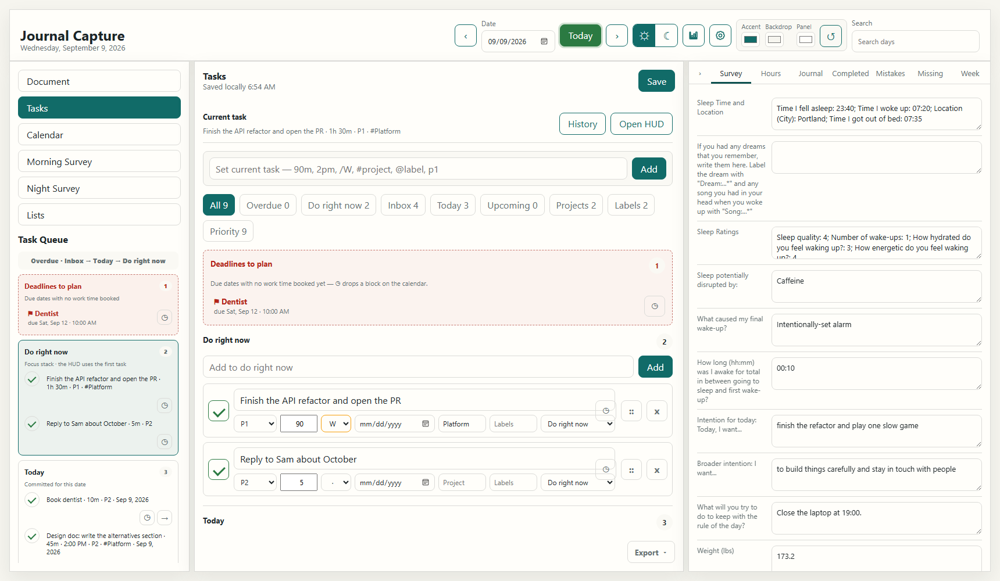

Tasks live in sections that describe when you mean to do them:

- **Do right now**: the focus stack. The first row is the current task; it is
  what the HUD shows.
- **Today**: committed for this date.
- **Inbox**: unsorted, carries forward every day until you place it.
- **Upcoming**: has a future due date.
- **Overdue** appears when something slips, and **Completed** keeps the
  history (the **History** button).

The quick-add box understands a little syntax, shown in its placeholder:
`90m` is an estimate, `2pm` a due time, `/W` a calendar category, `#project`,
`@label`, `p1` to `p4` a priority. Each task row has the same fields as
dropdowns. Priorities, projects and labels become filters along the top.

The clock button on a row **books the task on the calendar**: it drops a block
of the estimated length onto the day, and from then on moving the block moves
the task. The **Deadlines to plan** box lists tasks with a due date but no work
time booked yet, on the view and in the left column's Task Queue.

**Open HUD** starts the floating task window described [below](#the-task-hud).

## Calendar

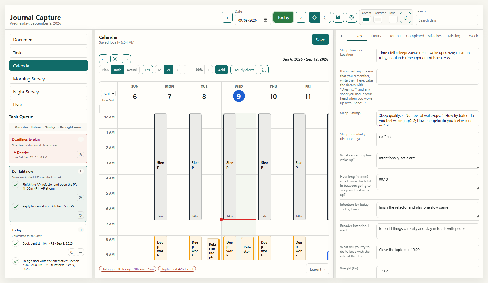

A week (or month, or day) of time blocks. Every block is either a **plan**
(what you meant to do), an **actual** (what happened) or a **deadline**, and
the Plan / Both / Actual toggle shows one or both. Blocks are coloured by
category: Work, Studying, Exercise, Health, Friends, Family, Sleep, Waste and
so on. The categories are the list near the top of `app.js` and the legend is
in the event editor.

Drag to create a block, drag a block to move it, drag its edge to resize.
Click one to edit:

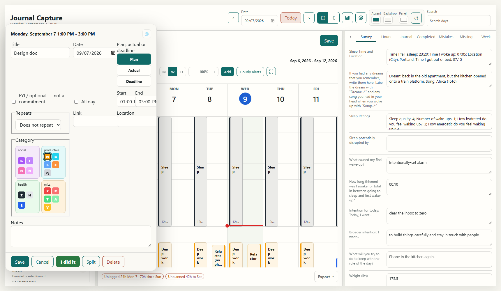

- **I did it** turns a plan into an actual in one click (a plan you did
  differently: edit the times first).
- **Split** cuts a block in two at a time you choose.
- **FYI / optional** marks a block that is not a commitment (a "maybe"); the
  FYI toggle above the grid hides and shows them.
- **Repeats** handles weekly and daily patterns with an end date and
  exceptions.
- **All day**, link, location and notes are what you would expect.

The two red chips at the bottom ("Unlogged 7h today", "Unplanned 42h to Sat")
are the honesty meters: hours of the past with no actual block, and hours of
the coming week with no plan. **Hourly alerts** turns on a notification each
hour asking what you did with the last one. `−` / `+` zoom the grid, and the
`⛶` button opens the calendar full screen.

Time zones are handled properly: each block remembers the zone it was made in,
and travel days show a divider where the clock changed. The dropdown at the
top-left of the grid chooses which zone you are viewing in.

If you connect a Google or Outlook calendar in Settings, its events appear
here read-only alongside your own.

## The output panel

The tabs on the right show the current day from different angles:

- **Survey**: every answer for the day as a two-column table, editable.
- **Hours**: an hour-by-hour log (what you did, category code) that the
  Process button drafts from the document and the calendar's actual blocks.
- **Journal**: the document as a reader, scrolling into earlier days.
- **Completed**: tasks finished today.
- **Lessons**: today's lesson rows, with the reflection boxes.
- **Missing**: what is still unanswered for the day.
- **Week**: the weekly digest.

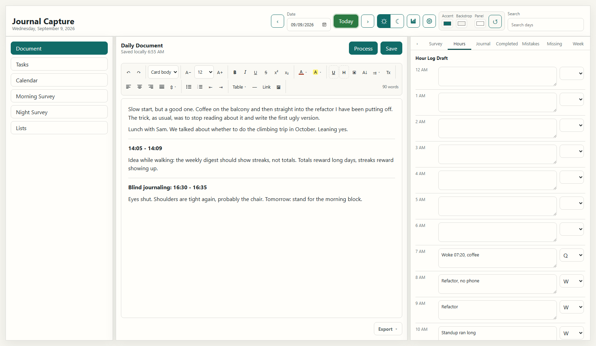

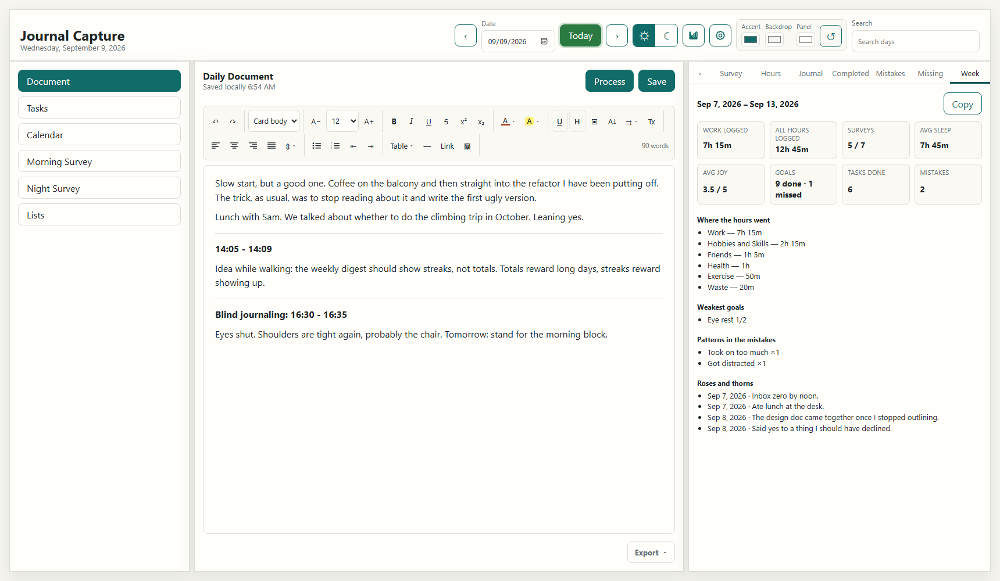

The digest adds up the week: hours logged and where they went by category,
surveys filled, average sleep and joy, goals done and missed, tasks done,
lessons and their recurring patterns, and the week's roses and thorns. The
**Copy** button puts it on the clipboard as text.

## Lists: lessons, learn-about, shopping

These are standing lists rather than day pages, under **Lists** in the left
column.

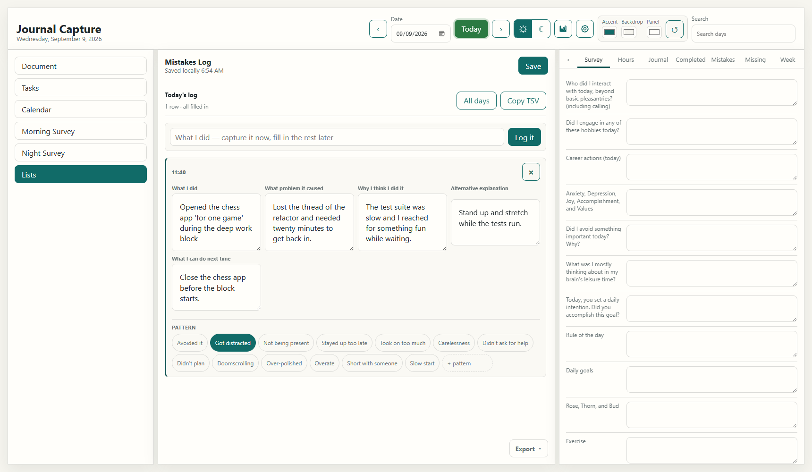

**Lessons from experience** is one row per thing worth remembering, with five
boxes: what I did, what problem it caused, why I think I did it, an alternative
explanation, and what I can do next time. Only the first box is required, on
purpose; capturing the moment matters more than the reflection, which the night
survey nags you to finish later. Each row also carries an outcome -- went well,
went badly, or left undecided -- so the log is not only a record of mistakes.
The **pattern** chips tag the row so Trends and the weekly digest can count
what keeps recurring; the vocabulary starts empty and grows from whatever you
type. **All days** shows the whole log; **Copy TSV** exports it.

It began as a mistakes-only log, which is why the file names, the hotkey script
and the API endpoint still say "mistakes".

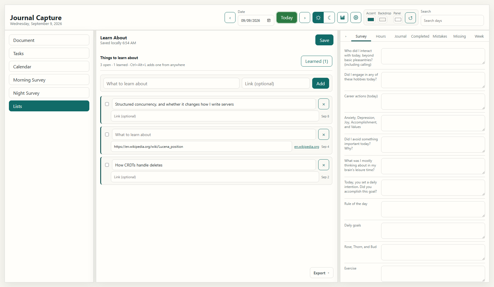

The **learn-about list** is a backlog of things to read up on: a topic, a
link, or both. Tick one when you have learned it; the **Learned** button shows
the done pile.

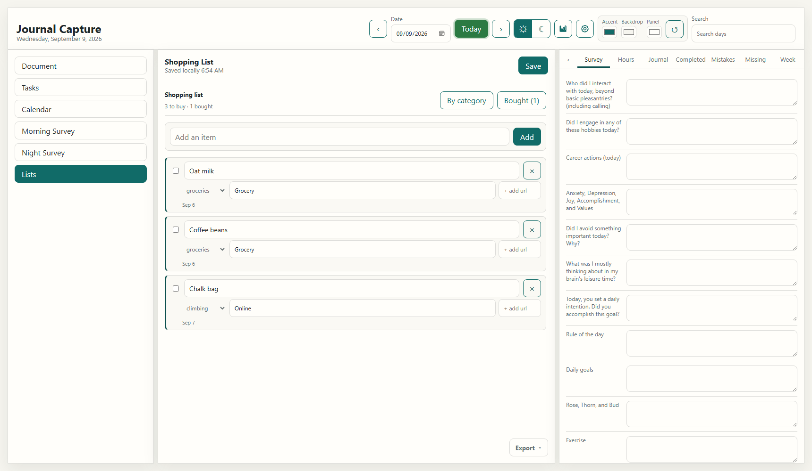

The **shopping list** groups items by a free-text category and where to buy
them, with optional links. **By category** regroups the view; **Bought** shows
what you have already picked up.

## The Rolodex

**Lists -> Rolodex** is a register of the people the night survey asks about.
Each person has a display name, any number of aliases, group tags and notes, and
the survey's "who did I interact with" question is drawn from it rather than
from a fixed list, so renaming someone or merging two spellings of one person
fixes every past answer's reading without rewriting any of them.

It also reads the day back to you. By the time you fill in the night survey the
day has been written down twice already -- as logged calendar blocks and in the
document -- so anyone named in either is lifted into an **Auto-detected today**
group at the top of the list, with confident matches already ticked and a note
saying who was ticked and what named them. Shared first names are surfaced but
never ticked for you: two people called Sam is exactly the case a guess gets
wrong.

## Goals, rules and the monthly review

Goals live in `goals.json` and come in a few kinds:

- **Rules**: standing principles ("Write the first ugly version before reading
  about it"). One rule is scheduled per day, in rotation. The morning survey
  asks how you will keep it; the night survey asks how it went, on a slider
  with a note. Add and retire rules in **Settings → Rules for life**.
- **Daily goals**: habits. Each either surfaces as a checkbox in the night
  survey or as a task that is created for you every morning and expires at
  the end of the day if not done. Ticking either one is the check-in.
- **Weekly and monthly goals** have a target count ("gym three times a week").
- **Projects** and **outcomes** are longer-running and are graded by
  judgement at the review.

Check-ins are an append-only log (`goal-log.json`), so nothing you tick is ever
overwritten by a later save. Goals can be tied to a **context** (say "home"
and "travel") and switched off outside it.

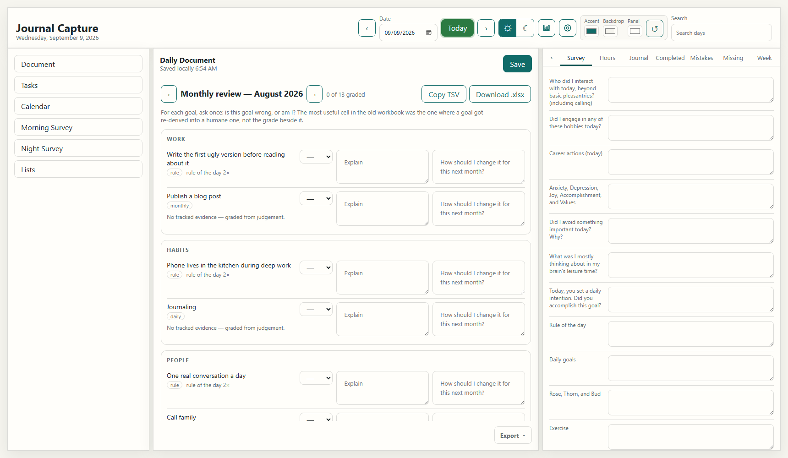

Once a month, **Trends → Monthly review** walks every active goal grouped by
category. Each gets a grade and an explanation, and the tracked evidence
(rule ratings, daily ticks, weekly counts) is shown beside it so you grade from
the record rather than from memory. The prompt at the top says what the page is
for: is this goal wrong, or am I? Reviews export as TSV or a spreadsheet.

## Trends

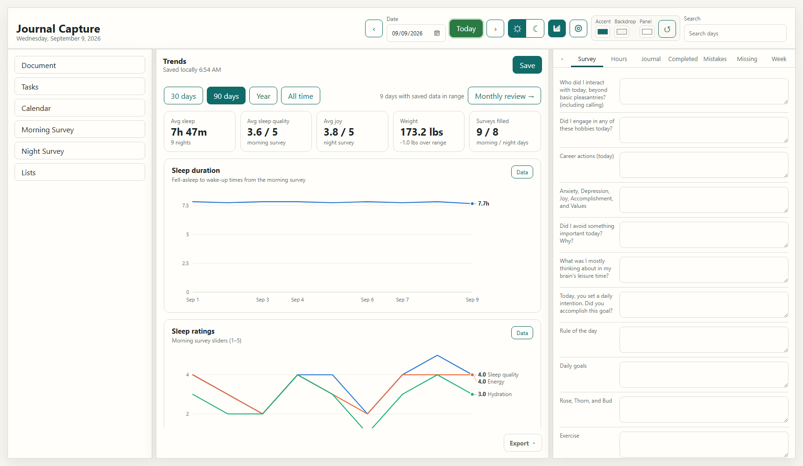

Charts over 30 days, 90 days, a year or everything: sleep duration and
ratings, mood sliders, weight, survey completion, hours by category, goal
streaks, mistake patterns and more. Each chart has a **Data** button that shows
the numbers behind it. The digest at the bottom of the view points out
anything that has moved (once there are enough days for it to mean something).

## Settings

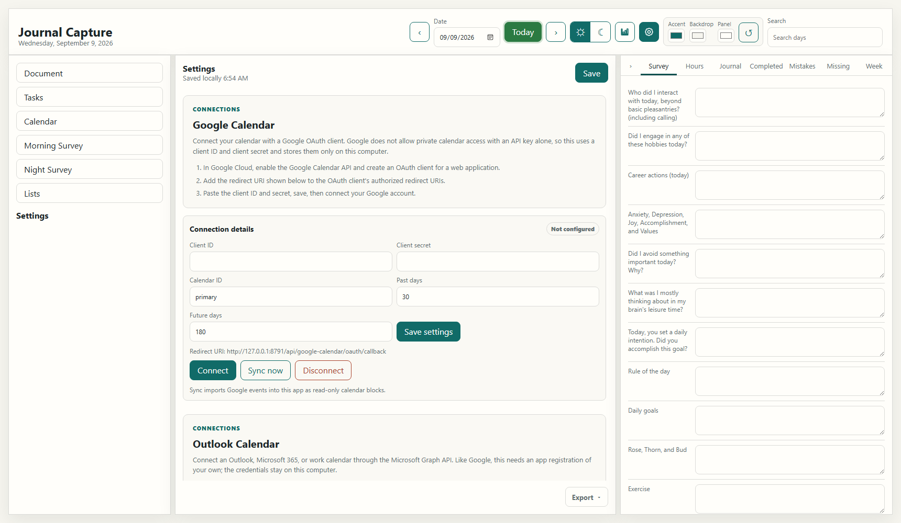

- **Google Calendar** and **Outlook Calendar** connections. You create your own
  OAuth client and paste its ID and secret. Sync runs both ways: provider events
  come in, and blocks you plan here go back out. Credentials stay in local files.
- **Spotify**: optional, same shape. Connect it and the server logs what you
  played every ten minutes into `spotify-listens.json`.
- **Survey question types**: which of the 26 question types the add-question
  picker offers. The questions themselves are edited from the survey views.
- **Time zones**: the log of where you have been living, used by the calendar.
- **Completion animations**: which animations the task HUD may play when you
  tick a task off.
- **Rules for life**: add, reorder and retire the rules that rotate through
  "rule of the day".

## On a phone

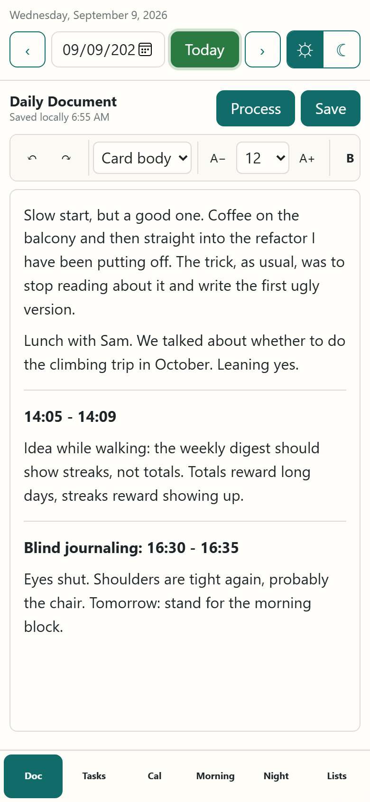 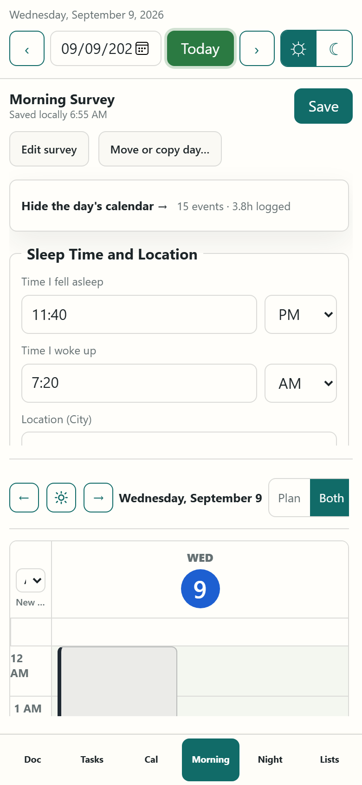

Start the server with `JOURNAL_HOST=0.0.0.0` and open the printed address on a
phone on the same Wi-Fi. The layout switches to a single column with a tab
bar at the bottom; add it to the home screen and it behaves like an app,
including working offline and syncing when it reconnects. Edits from the phone
and the desktop merge; a change made on one never silently overwrites the
other. There is no login, so keep the server on networks you trust.

## Windows hotkeys: capture without opening the app

The scripts in `windows\` run in the background and put a small window on
screen when you press a global hotkey, anywhere in Windows. Type, press
**Ctrl+Enter**, and you are back where you were. See
[windows/README.md](../windows/README.md) for starting them and changing the
hotkeys.

**Ctrl+Alt+Q, quick journal.** One box. Whatever you type lands in today's
document as a block headed with the time range you had the window open. Esc
hides it and keeps the draft; the hotkey brings the same draft back.

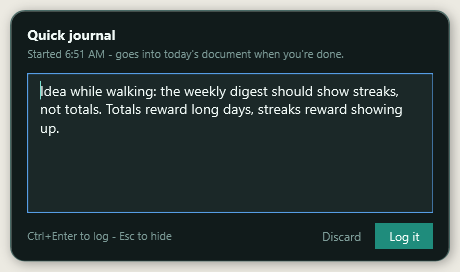

**Ctrl+Alt+W, log a lesson.** The five boxes of the lessons log, plus the
went-well/went-badly choice you can leave undecided. Only the
first is needed; the rest can wait for the evening. Untick "This happened
today" to file it under another day.

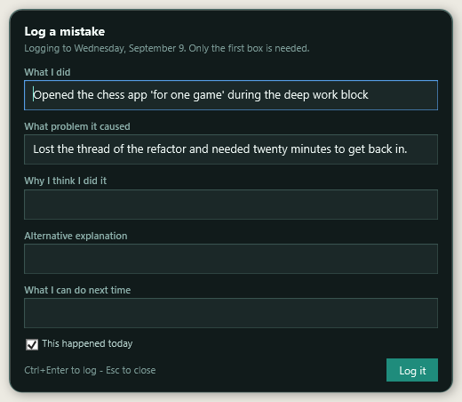

**Ctrl+Alt+L, learn about.** A topic and an optional link. If your clipboard
holds a URL it is filled in for you.

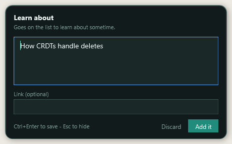

**Ctrl+Alt+C, thought record.** A CBT Daily Mood Log in the order the
Feeling Good Handbook gives it: the upsetting event, nine emotion families
scored before and after, up to three negative thoughts each with its
distortions ticked and a rational response, and the outcome. Only the event
and the first thought are required. The record lands in today's document as
labelled paragraphs.

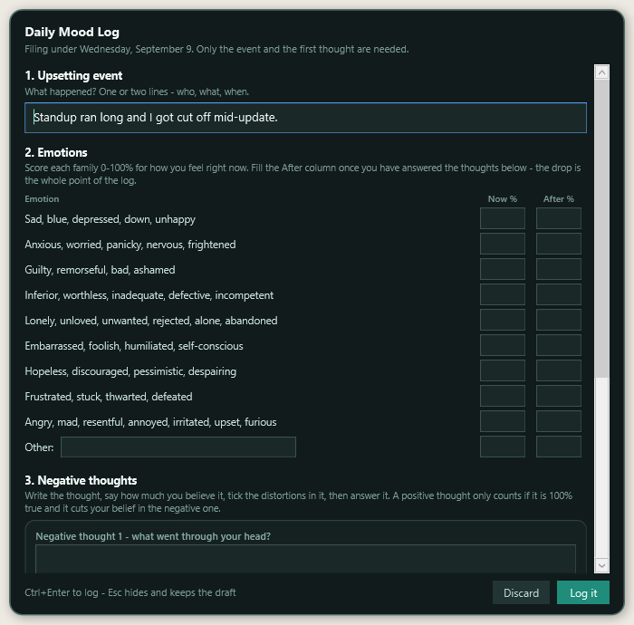

**Ctrl+Alt+E, eye rest.** A countdown (the length is editable and remembered)
with a gong at the end and a box to type into with your eyes shut. When the
gong sounds, a short review asks how you rested. The break is logged as an Eye
rest block on the calendar and the blind-journaling text goes into the
document, where it also counts as the day's journaling for the goal
check-ins.

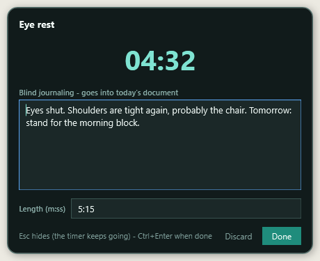 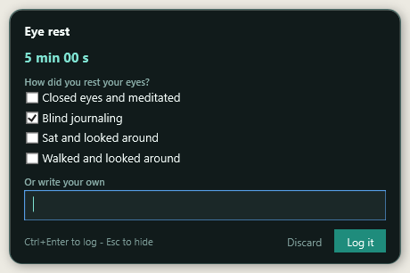

All five work with the server stopped: the window says "saved offline",
parks the capture in `outbox\`, and the server replays it next time it starts.

## The task HUD

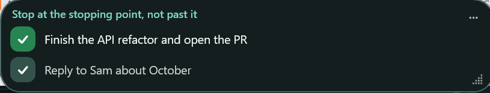

A small always-on-top window that lists the **Do right now** tasks with a
checkmark each. Tick one and it is completed in the app, with a brief
celebration animation (confetti, fireworks and friends; choose which in
Settings, or none). It stays out of Alt-Tab, remembers where you put it, and
**Ctrl+Z** undoes the last completion. Start it from `windows\launch-task-hud.vbs`
or the **Open HUD** button on the Tasks view.

## Work mode

**Ctrl+Alt+F** (Windows, `windows\launch-work-mode.vbs`) draws a thin green band
around the edge of the screen for as long as you are working. There is no window
to look at: the band is the whole interface, so the state is visible from across
the room and invisible to a screenshot of any one app. Press it again, or pass
`-Minutes`, for a pomodoro. If you switch to something the distraction watch
counts as off-task, the band flashes.

Switching it off books the sitting on the calendar as a hot-pink **Work session**
with no category. That is deliberate: an uncategorised block is a to-do, not a
record. It says "this happened, decide what it was", and stays the one colour on
the calendar that means "not filed yet" until you categorise it.

## Your data, exports and backups

Everything is a file in the app folder:

| What | Where |
| --- | --- |
| Each day (document, both surveys, hours, tasks, lessons) | `entries/YYYY-MM-DD.json` |
| A Markdown export of each day, rewritten on every save | `exports/YYYY-MM-DD.md` |
| Calendar blocks | `calendar-events.json` |
| Goals and their check-in log | `goals.json`, `goal-log.json` |
| Learn-about and shopping lists | `learn-list.json`, `shopping-list.json` |
| Eye-rest sessions, HUD usage, task history | `eyerest-log.json`, `hud-log.json`, `task-log.json` |
| Choices you added to survey questions | `custom-choices.json` |
| Monthly reviews | `monthly-reviews.json` |

`backups/` holds a daily snapshot of all of it plus a history copy every time a
file changes, so a bad edit is always one file-copy away from undone. Copy the
folder and you have copied the journal; there is nothing else anywhere.
